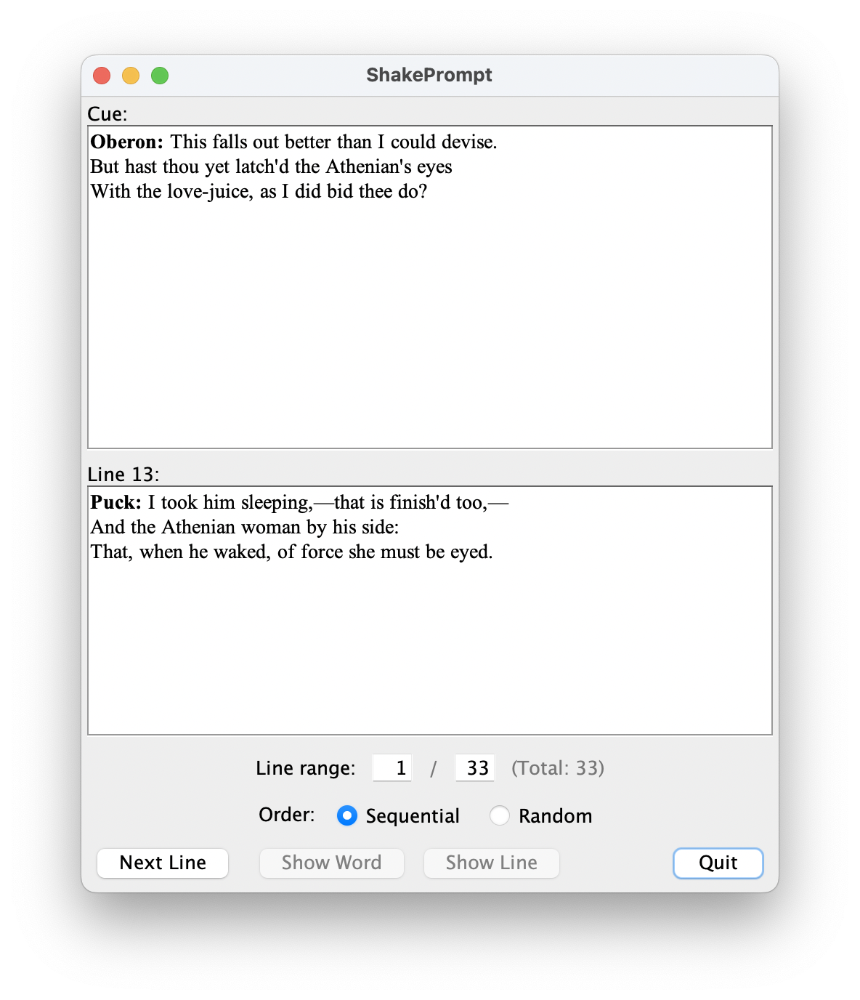

# ShakePrompt

## Introduction

ShakePrompt is a tool to help memorize Shakespeare.
It retrieves a complete list of a character's lines and cues
from [Open Source Shakespeare],
then displays the cues one by one (sequentially or randomized),
and lets the user learn their lines
by incrementally or instantly revealing their character's response.

[Open Source Shakespeare]: http://opensourceshakespeare.org/

Play selection:


Character selection:


The main prompting interface:



## Use

Download the JAR of the [the latest release].
Double-click it to launch it,
or run from the command line:

```
java -jar shakeprompt-1.1.0.jar
```

Requires Java 8 or higher to be installed.
A suitable distribution –
Eclipse Temurin –
can be downloaded from [the Adoptium project].

[the latest release]: https://github.com/MrDOS/shakeprompt/releases
[the Adoptium project]: https://adoptium.net/

## Project status

The project is “done enough” for what it set out to do and be.
There's obvious room for improvement
(e.g., being able to return to the play/character selection
without restarting the application,
text-to-speech reading of cues),
but Java is almost certainly the wrong platform
for this application,
so supplementing it would be a waste of effort.
Java was a reasonable choice when I first wrote it:
the venue that my friends and I were performing in
did not have good Wi-Fi coverage,
and cellular data was prohibitively expensive.
However, it's been years since we produced a Shakespeare,
and we've switched to using a web-based tool
for line training/prompting.
Works much better on those “smartphone” devices
that we all tend to carry nowadays.
